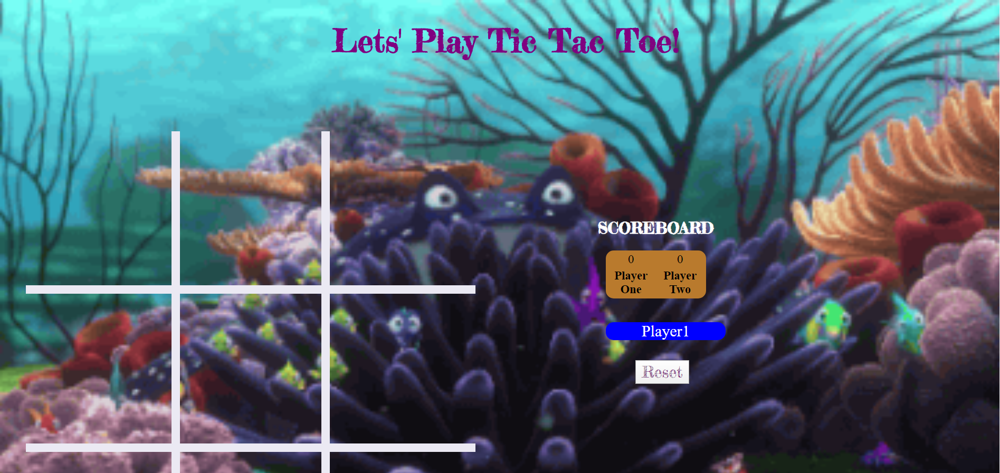

#  📌 Tic Tac Toe

**Goal:** Create a simple  tic tac toe game with a reset button and score counter

**Link to project:** TBA

## How It's Made:

  **Languages used:**  HTML, CSS, JavaScript

  - When a player clicks on on of the square, it triggers an event listener to check if there a winning combination and increase the score 
  if not continue the game. press the reset button to clear the board.
  
## Optimizations
  - ADD a color over the winning commbination on the DOM.
  - IMPROVE syntax consistency
  
## Examples:
Take a look at these couple examples that I have in my own portfolio:

**Slot Machine:** https://github.com/zjacobsdev/slot-machine-2019-week05/tree/answer
